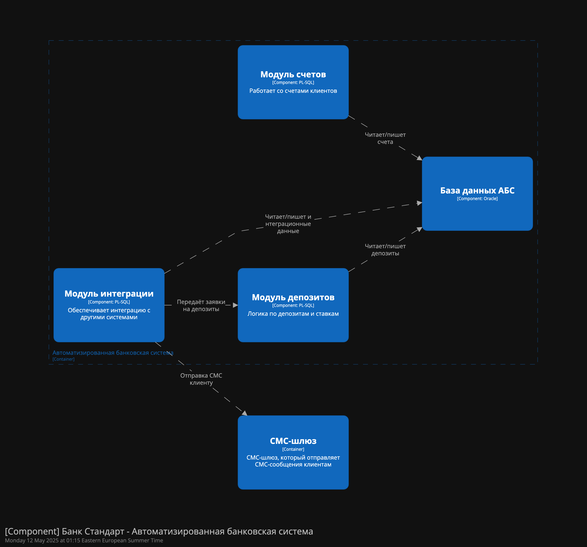
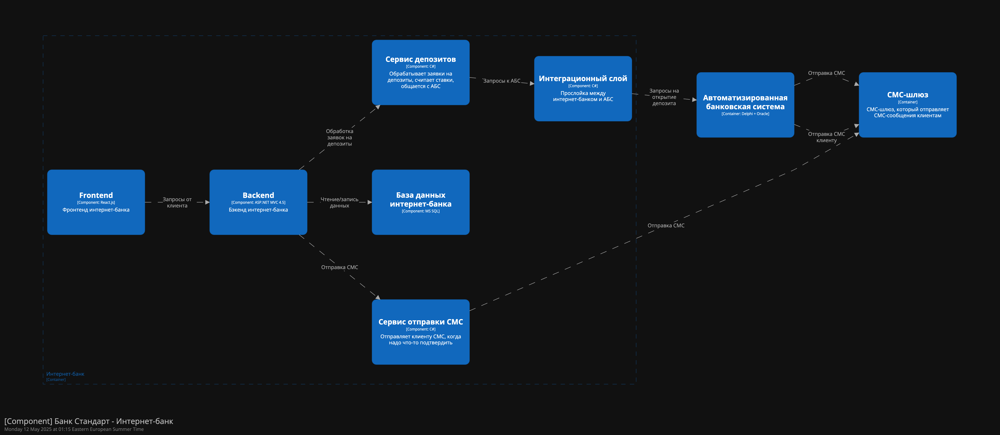
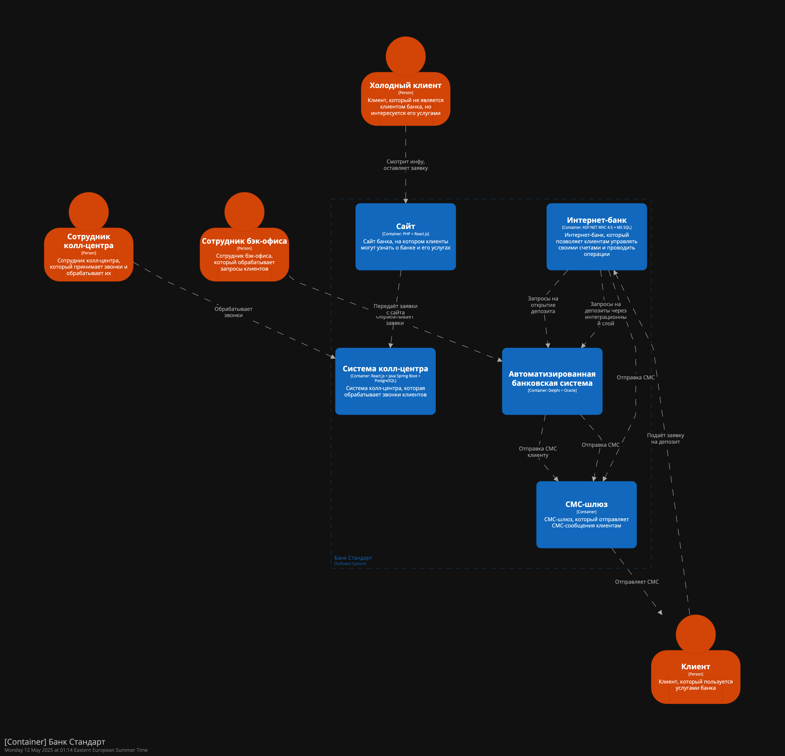
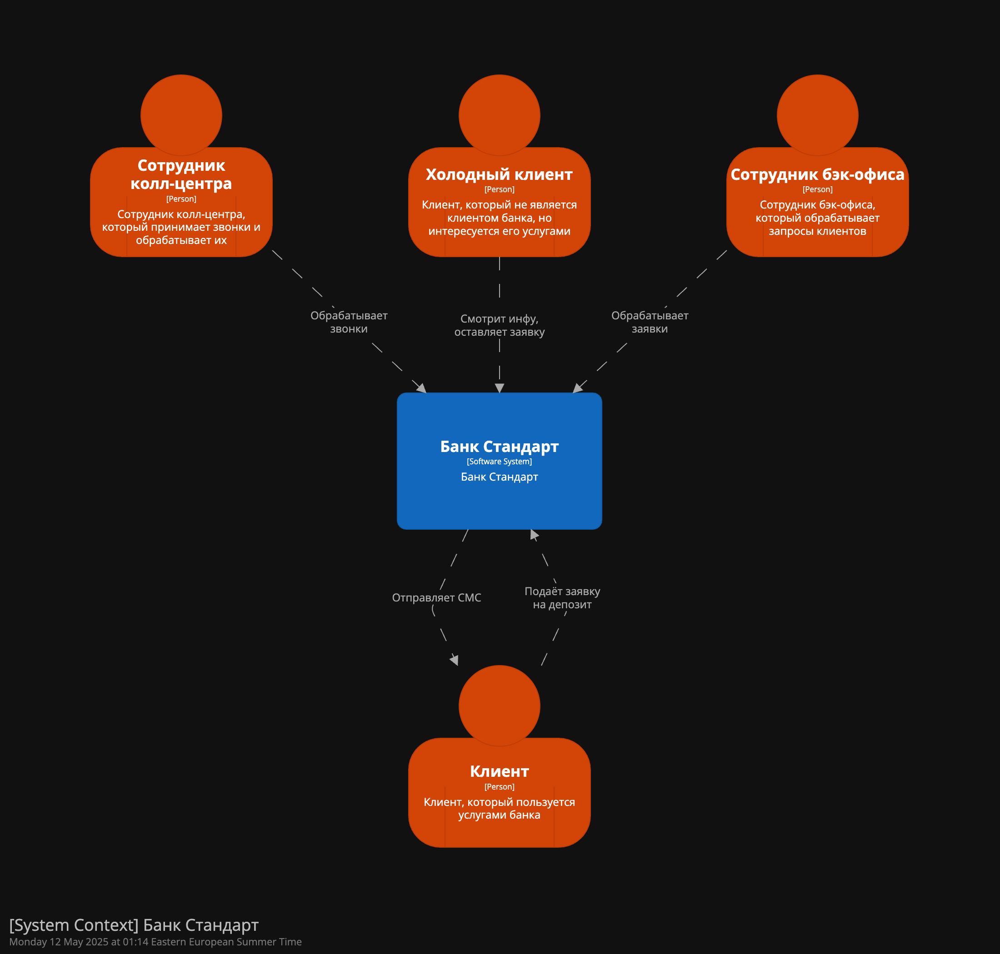

### **Название задачи: Разработка MVP пл онлайн открытию депозитов**

### **Автор: Михаил Крутихин**

### **Дата: 12.05.2025**

### **Функциональные требования**

| №   | Действующие лица или системы            | Use Case                                             | Описание                                                                                                                                                                                                                                                                                                          |
| --- | --------------------------------------- | ---------------------------------------------------- | ----------------------------------------------------------------------------------------------------------------------------------------------------------------------------------------------------------------------------------------------------------------------------------------------------------------- |
| 1   | Клиент, Сайт                            | Подача заявки на депозит через сайт                  | 1. Клиент заходит на сайт банка 2. Смотрит какие там депозиты и ставки 3. Заполняет форму -- имя, телефон,  всё 4. Жмёт отправить 5. Заявка улетает в кол-центр 6. Отображается успех отправки формы                                                                                               |
| 2   | Менеджер кол-центра, Система кол-центра | Обработка заявки с сайта                             | 1. Менеджер видит новую заявку 2. Звонит клиенту, спрашивает что интересует 3. Может предложить что-то особенное 4. Если всё ок то отмечает результат в системе 5. Дальше заявка уходит в АБС                                                                                                         |
| 3   | Клиент, Интернет-банк                   | Подача заявки на депозит через интернет-банк         | 1. Клиент заходит в интернет-банк (логинится) 2. Смотрит какие депозиты есть, видит свои ставки 3. Выбирает что хочет, указывает счёт и сумму 4. Жмёт отправить заявку 5. Получает СМС с кодом 6. Вводит код, подтверждает 7. Заявка уходит в АБС   8. По итогу решения клиенту приходит СМС |
| 4   | Менеджер бэк офиса, АБС                 | Обработка заявки на депозит                          | 1. Менеджер бэк-офиса видит новую заявку в АБС 2. Проверяет всё ли ок с данными и деньгами 3. Если надо то согласует ставку (иногда пишет коллегам) 4. Подтверждает открытие депозита 5. АБС отправляет СМС клиенту что всё готово или если что-то не так                                             |
| 5   | Система АБС, СМС-шлюз, Клиент           | Уведомление клиента о статусе заявки                 | 1. После обработки заявки АБС формирует уведомление 2. Передаёт его в СМС-шлюз 3. СМС-шлюз отправляет сообщение клиенту 4. Клиент получает СМС типа "Депозит открыт" или "Ждём вас в отделении"                                                                                                          |
| 6   | Менеджер офлайн офиса, Клиент, АБС      | Идентификация клиента и завершение открытия депозита | 1. Клиент приходит в отделение (если надо) 2. Менеджер смотрит документы, сверяет 3. Вносит подтверждение в АБС 4. Депозит активируется 5. Клиенту дают бумажку что всё ок 6. АБС обновляет статус депозита                                                                                        |

### **Нефункциональные требования**

Опишите здесь нефункциональные требования и архитектурно-значимые требования.

  

| **№** | **Требование**                                                                                                                           |
| ----- | ---------------------------------------------------------------------------------------------------------------------------------------- |
| 1     | Все данные клиента должны шифроваться, tsl ssl                                                                                           |
| 2     | Интернет-банк и сайт должны быть доступны 24/7  (99.9% uptime)                                                                           |
| 3     | Отклик по операциям <1c                                                                                                                  |
| 4     | Не работать напрямую с АБС из интернет-банка — нужен какой-то прослойка/шина, на примете kafka но для АБС нужны доп усилия для внедрения |
| 5     | Использовать только те технологии, с которыми у команды уже есть опыт (MS SQL, Java, PL-SQL, ASP.NET MVC 4.5 и т.д.)                     |
| 6     | При внедрении нового, тщательно проверять совместимость                                                                                  |
| 7     | Сервисы внедренные в рамках MVC должны быть готовы масшабироваться горизонтально                                                         |
| 8     | Документация к новым компонентам                                                                                                         |
| 9     | Доработка по СМС средствами банка                                                                                                        |
| 10    | UI в дизайн коде банка                                                                                                                   |

### **Решение**

  

доступ к АБС из интернет-банка исключён — реализован интеграционный слой.
Для производительности и минимизации задержек ключевые операции разделены по сервисам, отклик системы не должен превышать 1 секундыж
Для масштабируемости интернет-банк реализован с возможностью горизонтального масштабирования, АБС защищена от лишней нагрузки.
Для поддерживаемости и снижения рисков используются только те технологии, с которыми у команды уже есть опыт.

### **Альтернативы**

- Прямое подключение интернет-банка к АБС без интеграционного слоя.
- Внедрение новых технологий (например, Kafka) для интеграции между системами.

### Недостатки, ограничения, риски

- Интеграционный слой увеличивает сложность поддержки и требует отдельных ресурсов.
- АБС масштабируется только вертикально, что ограничивает рост нагрузки.
- Использование только существующих технологий может замедлить внедрение современных решений.