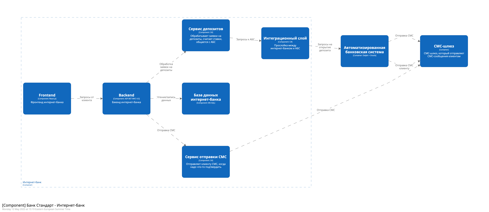

### **Название задачи: Передача ставок в кол центр**

### **Автор: Михаил Крутихин**

### **Дата: 12.05.2025**

### **Функциональные требования**

| №   | Действующие лица или системы             | Use Case                    | Описание                                                                                                                            |
| --- | ---------------------------------------- | --------------------------- | ----------------------------------------------------------------------------------------------------------------------------------- |
| 1   | Менеджер кол-центра, Система кол-центрат | Получение актуальных ставок | Менеджер видит в системе кол-центра актуальные ставки по депозитам для консультации клиентов                                        |
|     | Система банка, Система кол-центра        | Передача ставок в кол-центр | Система банка регулярно выгружает актуальные ставки и передаёт их в систему кол-центра                                              |
|     | Система банка, Партнёрский кол-центр     | Передача ставок партнёру    | Система банка формирует файл с актуальными ставками и отправляет его во внешнюю систему партнёрского кол-центра (например, по SFTP) |

### **Нефункциональные требования**
| **№** | **Требование**                                                                                                                           |
| ----- | ---------------------------------------------------------------------------------------------------------------------------------------- |
| 1     | Все данные клиента должны шифроваться, tsl ssl                                                                                           |
| 2     | Интернет-банк и сайт должны быть доступны 24/7  (99.9% uptime)                                                                           |
| 3     | Отклик по операциям <1c                                                                                                               |
| 4     | Не работать напрямую с АБС из интернет-банка — нужен какой-то прослойка/шина, на примете kafka но для АБС нужны доп усилия для внедрения |
| 5     | Использовать только те технологии, с которыми у команды уже есть опыт (MS SQL, Java, PL-SQL, ASP.NET MVC 4.5 и т.д.)                     |
| 6     | При внедрении нового, тщательно проверять совместимость                                                                                  |
| 7     | Сервисы внедренные в рамках MVC должны быть готовы масшабироваться горизонтально                                                         |
| 8     | Документация к новым компонентам                                                                                                         |
| 9     | Доработка по СМС средствами банка                                                                                                        |
| 10    | UI в дизайн коде банка                                                                                                                   |
| 11    | Данные ставок при передаче должны быть защищены                                                                                          |
| 12    | Обновлять ставки не реже раза в день                                                                                                     |
| 13    | Формат солгласованный с системой партнера                                                                                                |
| 14    | Логировать передаваемые данные, что бы котролировать то что мы передаем 3 лицам                                                          |

### **Решение**

  

### **Альтернативы**
- Передача ставок через API (не подходит для партнёра).
- Ручная отправка файлов сотрудниками (риск ошибок).

### **Недостатки, ограничения, риски**

- Необходимость поддерживать совместимость формата файла с системой партнёра.
- Возможные задержки при передаче файлов (особенно внешним кол-центрам).
- Требуется мониторинг успешности передачи и обработки файлов.